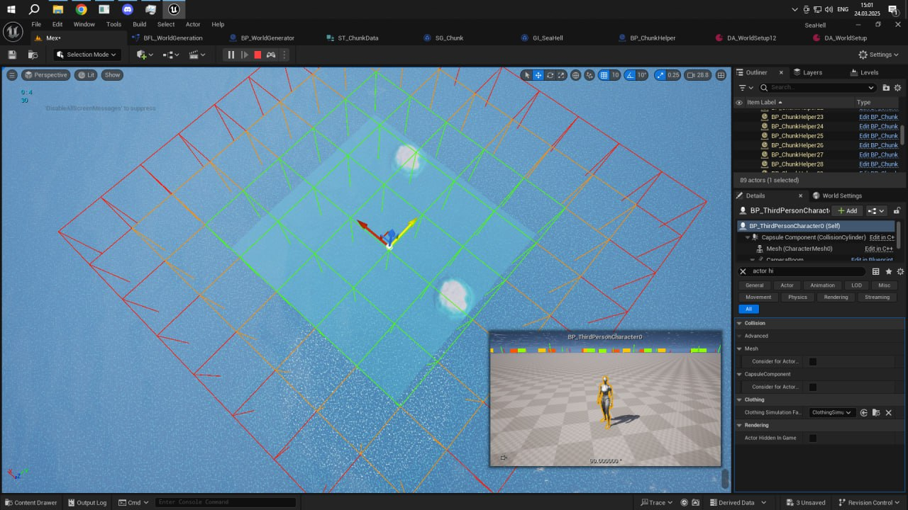
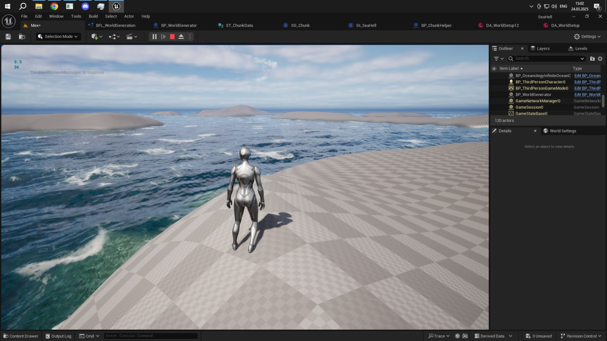

# UE5-World-Generation

Система процедурной генерации мира с использованием level streaming на Blueprint. Динамическая загрузка и выгрузка чанков ландшафта при перемещении игрока, оптимизированная под большие открытые миры.

## Как это работает

- **Level Streaming** — автоматическая загрузка/выгрузка чанков на основе позиции игрока
- **Procedural Generation** — процедурное размещение ландшафта
- **Chunk System** — разделение мира на управляемые части для оптимизации
- **Infinite World** — возможность генерировать бесконечный или очень большой мир без упада FPS
- **Persistent State** — сохранение состояния каждого чанка при выгрузке и восстановление при новой загрузке игры

## Визуальные характеристики

- Видимые границы чанков загрузки (для отладки и оптимизации)
- Динамическое управление видимостью объектов
- Оптимизация памяти через выгрузку дальних чанков

## Технические детали

**Движок**: Unreal Engine 5  
**Язык**: Blueprint  
**Ключевая особенность**: Level Streaming + процедурная генерация без кода

## Примечание

Система использует стандартный UE5 level streaming с кастомной логикой на Blueprint для управления грид-системой и генерацией данных. Подходит как основа для открытомирных игр с высокой производительностью.

---

## Скриншоты

### Система чанков в редакторе

### Генерированный мир в игре

### Видео
[Посмотреть демонстрацию на YouTube](https://youtu.be/yYecm29sqSU)
